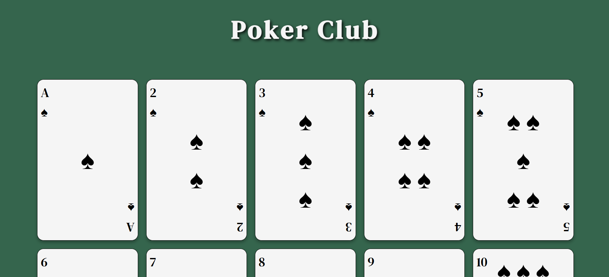

# 📁 Page of Playing Cards

## ℹ️ A Poker Club page displaying a set of playing cards

A simple yet detailed web page that displays a full set of spade playing cards using semantic HTML and custom CSS styling.

It was built entirely with HTML and CSS as part of the [**freeCodeCamp.org**](https://www.freecodecamp.org/learn/full-stack-developer/) CSS course.

---

## 🔍 Overview

This project recreates a page of playing cards using only HTML and CSS. Each card contains three distinct sections: a top-left label, a center symbol display, and a bottom-right label rotated to reflect a real deck layout.

The layout leverages **Flexbox** for wrapping and alignment, and uses Unicode symbols for card values, creating a clean and organized grid of styled cards.

---

## ✨ Features

- Custom layout for Ace through King (♠️ suit)
- Centered Unicode symbols (♠, ♞, ♛, ♚) for realism
- Top-left and bottom-right mirrored corners
- Rotated text for authentic card appearance
- Clean typography using Google Fonts
- Responsive layout using Flexbox
- Subtle box shadows and border radius for visual depth

---

## 🧠 What I Learned

- How to create reusable card components with consistent structure
- Using Flexbox to build a responsive grid layout
- Rotating elements for design realism
- Styling multi-line text with spacing and alignment
- Working with Unicode characters and layout spacing
- Designing with minimal HTML and scalable CSS

---

## 🛠️ Tech Used

- HTML5
- CSS3

---

## 🚀 How to Run

1. Clone the repository
2. Navigate to this project folder
3. Open `index.html` in your browser

---

## 🌐 Live Demo

Or you can check out the 👉 [live website here](https://html-css-daily.netlify.app/build%20a%20page%20of%20playing%20cards/)

---

## 🧑‍💻 Author

Created by **Elmar Chavez**

🗓️ Month/Year: **May 2025**

📚 Journey: **2nd** month of learning _frontend web development_.
